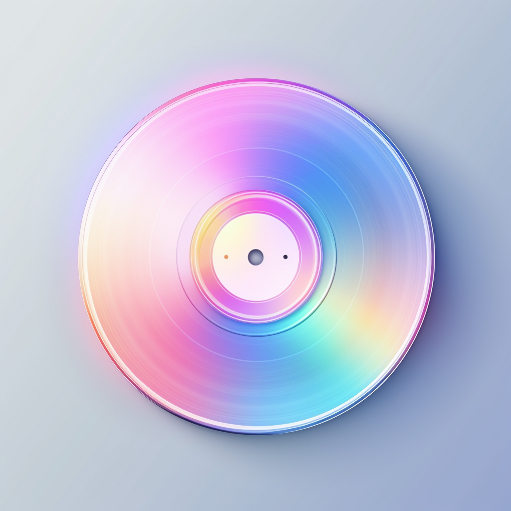

# MuzakBot

A Discord bot to easily share music from one music streaming service to other streaming services.

## 🗂️ Dependencies used

* [Discord.NET](https://github.com/discord-net/Discord.Net)
* [Songlink/Odesli API](https://odesli.co)
    * [API documentation](https://linktree.notion.site/API-d0ebe08a5e304a55928405eb682f6741)

## 🤝 License

The source code for this project is licensed with the [MIT License](./LICENSE).