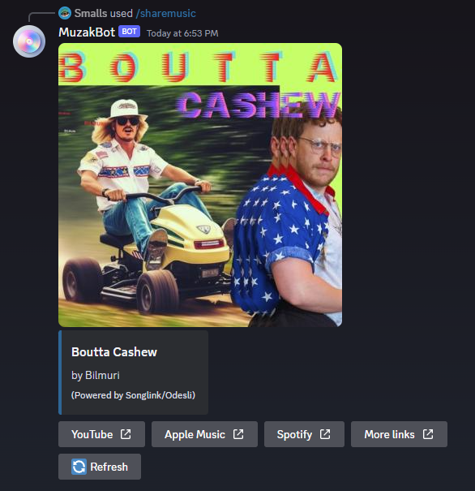

# MuzakBot

A Discord bot to easily share music from one music streaming service to other streaming services.

## Usage

[Add to your Discord server!](https://discord.com/api/oauth2/authorize?client_id=1131341120924831866&permissions=274877958144&scope=bot+applications.commands)

### Slash commands

#### `/sharemusic`

Generate share links for a song or album.

##### Example

`/sharemusic url:https://www.youtube.com/watch?v=QdUE9_G94pg`

It will generate the following:

## 🗂️ Dependencies used

* [Discord.NET](https://github.com/discord-net/Discord.Net)
* [Songlink/Odesli API](https://odesli.co)
    * [API documentation](https://linktree.notion.site/API-d0ebe08a5e304a55928405eb682f6741)

## 🤝 License

The source code for this project is licensed with the [MIT License](./LICENSE).